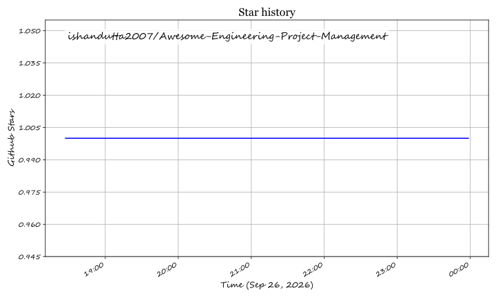

# Awesome-Engineering-Project-Management

## Top Engineering Project Management Platforms Ecosystem

**Curated List of SaaS Products & Open-Source GitHub Projects**

*Focused on A/E/C & Professional Services Project Accounting, Resource Planning, Time & Billing, PSA and Engineering Firm Operations*

**Last updated: September 2026**

This repository tracks notable **SaaS platforms** and **open-source projects** for **Engineering Project Management** (often overlapping with Professional Services Automation / PSA). These systems help architecture, engineering, consulting, and professional services firms manage projects, resources, time, expenses, billing, and profitability.

**Examples** include Deltek Vantagepoint, BQE CORE, Unanet, BigTime, Projectworks, Scoro, Forecast, Kantata, Productive, and Mavenlink (the category leaders).

**Open-source emphasis**: Full-featured PSA and A/E project accounting platforms are largely commercial. Strong open alternatives include **OpenProject**, **Worklenz** (PSA-oriented), **ERPNext**, **Odoo**, and classic project tools (Redmine, etc.). This section expands those options while remaining realistic about industry-specific accounting and compliance depth.

Contributions welcome! Open a PR to add/update entries. Keep descriptions factual and link to official sites.

## Table of Contents

- [SaaS/Hosted Platforms](#saas-products)

- [Open-Source GitHub Projects](#open-source-github-projects)

- [How to Contribute](#how-to-contribute)

- [Disclaimer](#disclaimer)

## SaaS/Hosted Platforms

- **[Deltek Vantagepoint](https://www.deltek.com/)**  

  Leading project-based ERP/PSA for architecture, engineering, and professional services firms—strong project accounting, multi-entity support, and compliance-oriented workflows.

- **[BQE CORE](https://www.bqe.com/)**  

  Cloud PSA and accounting platform popular with small-to-midsize architecture and engineering firms for time, billing, projects, and profitability.

- **[Unanet](https://www.unanet.com/)**  

  Project-based ERP and PSA focused on engineering, architecture, and government contracting with robust financial and compliance features.

- **[BigTime](https://www.bigtime.net/)**  

  Time, billing, and project management platform widely used by professional services and engineering firms.

- **[Projectworks](https://www.projectworks.com/)**  

  Resource planning, project management, and profitability platform aimed at professional services organizations.

- **[Scoro](https://www.scoro.com/)**  

  Work management and PSA-style platform covering projects, CRM, quoting, and financials for service businesses.

- **[Forecast](https://www.forecast.app/)**  

  AI-assisted project and resource management platform for professional services and delivery teams.

- **[Kantata (formerly Mavenlink + Kimble)](https://www.kantata.com/)**  

  Enterprise professional services automation for resource management, project delivery, and financial performance.

- **[Productive](https://www.productive.io/)**  

  Modern PSA platform for agencies and professional services—projects, resourcing, time, and billing in one system.

- **[Mavenlink and related PSA suites](https://www.kantata.com/)**  

  Legacy and integrated offerings now largely under broader Kantata/enterprise PSA portfolios for services delivery.

## Open-Source GitHub Projects

- **[OpenProject](https://github.com/opf/openproject)**  

  Feature-rich open-source project management platform with Gantt, agile boards, time tracking, budgets, and collaboration—suitable as a foundation for engineering project work.

- **[Worklenz](https://github.com/Worklenz/worklenz)**  

  Open-source PSA-oriented platform for project services firms—engagements, resourcing, timesheets, budgets, and invoicing (AGPL).

- **[ERPNext](https://github.com/frappe/erpnext)**  

  Full open-source ERP with project, timesheet, billing, and accounting modules that professional services and engineering firms can adapt.

- **[Odoo Project / Odoo Community](https://github.com/odoo/odoo)**  

  Open ERP suite including project management, timesheets, and related modules frequently customized for services businesses.

- **[Redmine](https://github.com/redmine/redmine)**  

  Mature open-source project management and issue-tracking application with plugins for time tracking and reporting.

- **[Taiga](https://github.com/taigaio/taiga)**  

  Open-source agile project management platform focused on kanban and scrum workflows.

- **[Plane](https://github.com/makeplane/plane)**  

  Modern open-source project management and issue tracking alternative with a clean UX.

- **[Time-tracking and timesheet open tools](https://github.com/)**  

  Community timesheet and utilization tools that can integrate with project systems for billable-hour capture.

- **[Resource planning open helpers](https://github.com/)**  

  Lightweight open approaches to capacity and utilization planning for smaller teams.

- **[Documentation and open PSA / PM playbooks](https://github.com/)**  

  Guides for deploying OpenProject, Worklenz, ERPNext, or Odoo as project and services management stacks.

### Additional Strong Open-Source Options

- Self-hosting **OpenProject** or **Worklenz** for project delivery, time, and basic PSA-style workflows.

- Using **ERPNext** or **Odoo** when full accounting and multi-module ERP are required alongside projects.

- Accepting that A/E-specific project accounting, DCAA/government compliance, multi-entity financials, and deep industry templates still favor commercial platforms (Deltek Vantagepoint, Unanet, BQE CORE, Kantata, Productive, etc.).

- Focusing open-source efforts on cost control, data ownership, and customization for smaller firms and engineering-led teams.

**Frameworks for building custom systems**: Deploy OpenProject or Worklenz for delivery and time → add ERPNext/Odoo for accounting and invoicing if needed → integrate resource views and reporting. Suitable for small-to-midsize firms with technical capacity. Larger A/E and professional services organizations typically adopt purpose-built commercial PSA/ERP platforms.

## How to Contribute

1. Fork the repo.

2. Add/edit entries in `README.md` (follow existing format).

3. Include: name, link, 1–2 sentence description, and whether it's SaaS or open-source.

4. Submit PR with a short explanation.

Star the repo if you find it useful!

## Disclaimer

- This is a **community-curated** list — not exhaustive and not an endorsement.

- Project accounting and PSA systems affect billing accuracy, compliance, and financial reporting. Open-source deployments require proper configuration, security, and (where applicable) accounting controls. This list is not financial, legal, or professional-services advice.

---

**Made for engineering firm leaders, project managers, and open-source advocates.**

Let's keep projects profitable, resources visible, and management tools as open as practical.

## ⭐ Star History

<a href="https://star-history.com/#ishandutta2007/Awesome-Engineering-Project-Management&Timeline" align="center">
  <picture>
    <source media="(prefers-color-scheme: dark)" srcset="assets/ishandutta2007_Awesome-Engineering-Project-Management_growth.svg">
    
  </picture>
</a>
