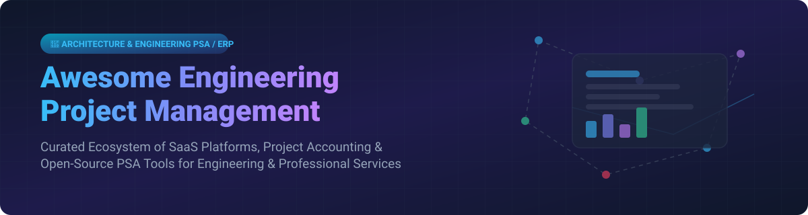

# 🛠️ Awesome Engineering Project Management

      

## 📌 Top Engineering Project Management & Professional Services Automation (PSA) Ecosystem

**Curated List of SaaS Products & Open-Source GitHub Projects**

*Focused on A/E/C & Professional Services Project Accounting, Resource Planning, Time & Billing, PSA, and Engineering Firm Operations.*

**Last updated: September 2026**

---

### 🔍 Overview & Market Insights

> **Market Size & Structure**: The global Professional Services Automation (PSA) and Engineering Project Management software market is estimated at **$12.5 Billion to $14.2 Billion (2026)**, growing at a CAGR of ~11.8%. The market is **moderately fragmented**: enterprise incumbents (e.g., Deltek, Kantata) dominate large A/E and government defense contracts, while a vibrant ecosystem of mid-market SaaS platforms (BQE CORE, BigTime, Scoro) and flexible open-source suites (Plane, Odoo, ERPNext) compete for mid-sized and specialized consulting teams.

This repository tracks notable **SaaS platforms** and **open-source projects** tailored for **Engineering Project Management**, **Architecture & Engineering (A/E)** project accounting, resource capacity management, timesheets, and billable profitability tracking.

---

## 📑 Table of Contents

- [☁️ SaaS / Hosted Platforms](#-saas--hosted-platforms)
- [💻 Open-Source GitHub Projects](#-open-source-github-projects)
- [🤝 How to Contribute](#-how-to-contribute)
- [☕ Support & Sponsorship](#-support--sponsorship)
- [⚠️ Disclaimer](#%EF%B8%8F-disclaimer)
- [📈 Star History](#-star-history)

---

## ☁️ SaaS / Hosted Platforms

Below is a curated tabular breakdown of commercial Professional Services Automation (PSA) and A/E project accounting software solutions, sorted by **Company Size / Revenue (Descending)**.

| Product Name | Description & Focus Areas | Company Size / Revenue / Valuation | Starting Price | Free Tier / Trial Limits |
| :--- | :--- | :--- | :--- | :--- |
| 🚀 **[Deltek Vantagepoint](https://www.deltek.com/)** | Enterprise project-based ERP & PSA designed for A/E, construction, and government contracting with strict compliance & project accounting. | **$1.0B+ Revenue** (Acquired by Roper / Private Equity) | Custom enterprise quote (~$60,000/yr minimum deployment) | **No Free Trial** (Guided personalized sandbox demos available upon request) |
| 📊 **[Kantata](https://www.kantata.com/)** | Enterprise PSA platform (merger of Mavenlink & Kimble) for resource optimization, billables, and delivery financials. | **~$150M+ Revenue** (Private Equity backed) | Custom quote based on seat count & scope | **No Free Trial** (Custom live demo & sandbox evaluation on request) |
| 💼 **[Unanet](https://www.unanet.com/)** | Project-based ERP & PSA engineered for architecture, engineering, and government contractor compliance (DCAA). | **~$82.5M Revenue** | Custom quote based on license role & deployment | **No Free Trial** (Interactive product demo upon request) |
| ⚡ **[BQE CORE](https://www.bqe.com/)** | Comprehensive cloud PSA & accounting tailored for small-to-midsize architecture & engineering firms. | **~$50M Revenue** | Custom quote (Modular: Foundations + Accounting/HR) | **No Free Trial** (Guided 1-on-1 demo available) |
| ⏱️ **[BigTime](https://www.bigtime.net/)** | Time tracking, project billing, and resource management engine for professional services & engineering practices. | **~$35M - $50M Revenue** ($117M funding raised) | **$20 / user / month** (Essentials Plan) | **No Free Permanent Tier** (Guided live demo available) |
| 📊 **[Scoro](https://www.scoro.com/)** | End-to-end work management & PSA suite combining projects, quoting, CRM, and financial reporting. | **~$21M Revenue** | **$26 / user / month** (Essential Plan, min 5 users) | **14-Day Free Trial** (Full feature access, no credit card required) |
| 📈 **[Projectworks](https://www.projectworks.com/)** | Cloud resource planning, project management, and margin tracking software for engineering consultants. | **$100M Valuation** ($12M Series A) | **$19 / user / month** (Build Plan) | **14-Day Free Trial** (Full access with sample data setup) |
| 🎯 **[Productive.io](https://www.productive.io/)** | All-in-one modern PSA platform for agencies, engineering consultancies, and billable service teams. | **~$7M Revenue** | **$10 / user / month** (Essential Plan billed annually) | **14-Day Free Trial** (Unlimited features, unlimited client invites) |
| 🔮 **[Forecast](https://www.forecast.app/)** | AI-native resource and project delivery management tool (Acquired by Accelo in 2025). | **Acquired by Accelo** | **$6.25 / user / month** (Lite Plan) | **14-Day Free Trial** (Full AI resourcing sandbox access) |

---

## 💻 Open-Source GitHub Projects

Below is a curated list of open-source project management, PSA, ERP, and timesheet repositories, sorted by **GitHub Star Count (Descending)**.

| Repository | Description & Engineering / PSA Focus | License | GitHub Stars |
| :--- | :--- | :--- | :--- |
| 📌 **[Plane](https://github.com/makeplane/plane)** | Modern, high-performance open-source project management & issue tracking alternative to Jira/Linear with Gantt and roadmaps. | Apache-2.0 |  |
| 💼 **[Odoo](https://github.com/odoo/odoo)** | Comprehensive open-source ERP suite featuring modular project management, timesheets, billing, and resource planning. | LGPL-3.0 |  |
| 🏗️ **[ERPNext](https://github.com/frappe/erpnext)** | Full-featured open-source ERP system with dedicated project management, timesheets, profitability tracking, and job costing. | GPL-3.0 |  |
| 📋 **[Focalboard](https://github.com/mattermost/focalboard)** | Open-source, self-hosted project management board alternative to Trello and Notion for engineering workflows. | AGPL-3.0 |  |
| 🚀 **[OpenProject](https://github.com/opf/openproject)** | Feature-rich open-source project management platform supporting classic Gantt charts, agile boards, cost tracking, and budgets. | GPL-3.0 |  |
| ⏱️ **[Kimai](https://github.com/kimai/kimai)** | Advanced open-source web-based time tracker with budget management, invoicing, user rates, and detailed reporting. | MIT |  |
| 📊 **[Gauzy](https://github.com/ever-co/ever-gauzy)** | Open-source Business Management Platform & ERP/CRM/PSA software designed for agencies and engineering consultancies. | AGPL-3.0 |  |
| 🛠️ **[Redmine](https://github.com/redmine/redmine)** | Classic, highly extensible open-source project management & issue tracking tool with strong plugin ecosystem for time management. | GPL-2.0 |  |
| 💡 **[Leantime](https://github.com/leantime/leantime)** | Open-source strategic project management platform combining task management, ideas, and milestone planning for tech teams. | GPL-2.0 |  |
| ⚡ **[Worklenz](https://github.com/Worklenz/worklenz)** | Open-source PSA platform engineered for project service firms with resource planning, timesheets, and client invoicing. | AGPL-3.0 |  |

---

## 🤝 How to Contribute

Contributions are welcome! Please follow these steps to add or update solutions in this list:

1. Fork the repository.
2. Update `README.md` keeping the standard formatting and factual accuracy.
3. Ensure links point directly to official product pages or open-source GitHub repos.
4. Submit a Pull Request with a short summary of the updates made.

---

## ☕ Support & Sponsorship

If you find this curated ecosystem list helpful for evaluating software for your firm or open-source stack, consider showing your support:

- ⭐️ **Star** this repository to help others discover it.
- 🔀 **Fork** it to customize for your firm's internal software procurement stack.
- 📢 **Share** it with fellow project managers, engineering leaders, and software architects.
- 💖 **Sponsor**: Support open-source curation and development via [GitHub Sponsors](https://github.com/sponsors/ishandutta2007).

---

## ⚠️ Disclaimer

- This list is **community-curated** for informational purposes and does not constitute formal financial, legal, or software architecture advice.
- Pricing details and feature limits are accurate as of late 2026 and may change over time.
- Commercial trademarks belong to their respective owners.

---

## 📈 Star History

